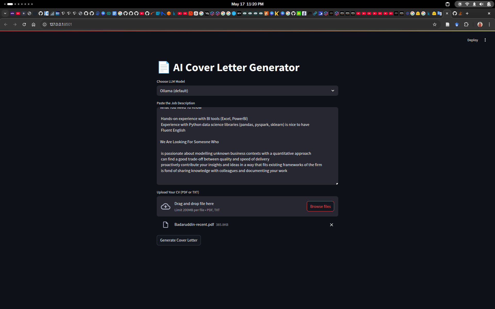
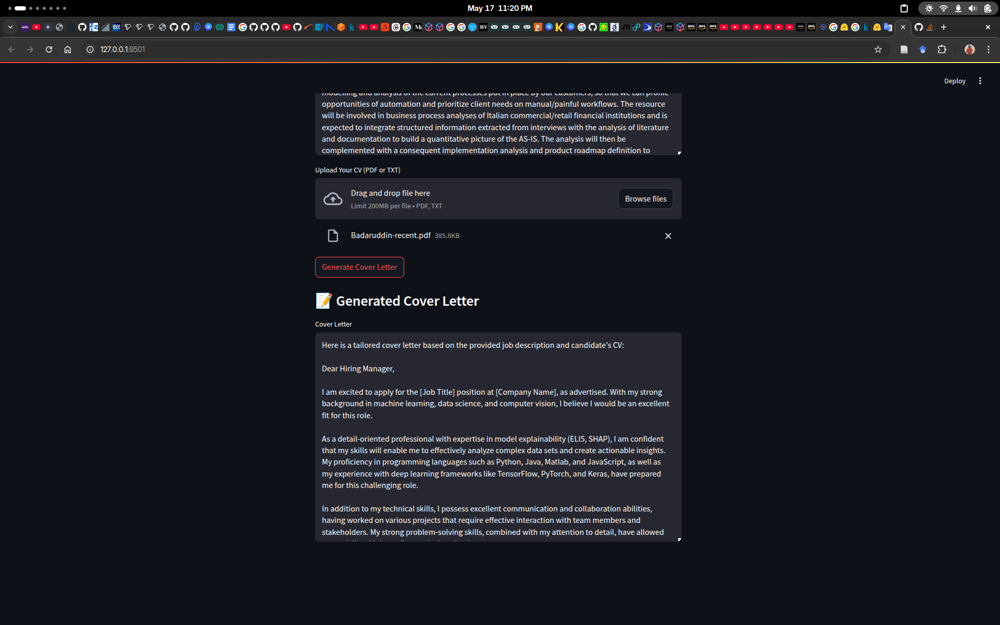

# 📄 AI Cover Letter Generator

An intelligent Streamlit application that generates **tailored, professional cover letters** using a **local LLM** via **Ollama** and **LangChain**. Upload your CV, paste a job description, and receive a personalized, high-quality cover letter in seconds.

---

## 🚀 Features

* ✅ Paste a job description into a rich text area
* ✅ Upload your CV in `.pdf` or `.txt` format
* ✅ Click a single button to generate a custom cover letter
* ✅ Uses **LangChain** + **Ollama** to run models locally (e.g., LLaMA 3, Mistral, etc.)
* ✅ Uses LangChain + Ollama or OpenAI API for generation
* ✅ Automatically aligns candidate experience with job requirements
* ✅ Avoids placeholders like `[Your Name]`; uses actual information from CV and job post

---

## 🌄 Screenshots

### 📂 Input Interface



### 📂 Generated Output



---

## 🧰 Tech Stack

* [Streamlit](https://streamlit.io/) – UI framework
* [LangChain](https://www.langchain.com/) – LLM orchestration
* [Ollama](https://ollama.com/) – Run large language models locally
* [PyPDF2](https://pypi.org/project/PyPDF2/) – PDF text extraction

---

## 🛠️ Setup Instructions

Follow these steps to get the project running locally.

### 1. Clone the Repository

```bash
git clone https://github.com/bchachar/cover_letter_generator.git
cd cover_letter_generator
```

### 2. Create a Virtual Environment (Optional but Recommended)

```bash
python -m venv venv
source venv/bin/activate  # On Windows: venv\Scripts\activate
```

### 3. Install Dependencies

```bash
pip install -r requirements.txt
```

---

## 🧠 Install Ollama & Pull a Local Model

### 1. Install Ollama

* Follow the guide at: [https://ollama.com/download](https://ollama.com/download)
* For macOS / Linux / Windows, just download and install the package.

### 2. Pull a Supported Model

We recommend using `llama3`:

```bash
ollama pull llama3
```

Other great options:

```bash
ollama pull mistral
ollama pull gemma
```

### 3. Run Ollama (usually starts automatically)

You can start it manually if needed:

```bash
ollama serve
```

> Ollama runs on `http://localhost:11434` by default — LangChain will connect automatically.

---

## 🧠 OpenAI ChatGPT API Setup
### 1. Get Your API Key
Sign up or log in at https://platform.openai.com/signup

Create an API key from https://platform.openai.com/account/api-keys

### 2. Set Your API Key as an Environment Variable
```bash
export OPENAI_API_KEY="sk-xxxxxxxxxxxxxxxxxxxxxxxxxxxxxxxx"
````
(Windows PowerShell)

```powershell
setx OPENAI_API_KEY "sk-xxxxxxxxxxxxxxxxxxxxxxxxxxxxxxxx"
```

---

## 🧪 Run the App

Once everything is installed:

```bash
streamlit run app.py
```

Open your browser to `http://localhost:8501` and enjoy!

---

## 📂 File Structure

```
cover-letter-generator/
│
├── app.py                   # Main Streamlit app
├── cover_letter_generator.py # LangChain logic (optional helper module)
├── requirements.txt         # Project dependencies
└── README.md                # This file
```

---

## 📌 Notes

* This app **does not send any data to external APIs** — all LLM inference happens locally.
* You can swap the model name (e.g., `llama3`) in the code to use another Ollama-supported model.
* Customize the prompt in `generate_cover_letter_with_ollama()` for your tone or format preference.

---

## 🙌 Acknowledgements

* [Ollama](https://ollama.com) for local model serving
* [LangChain](https://www.langchain.com) for simplifying LLM workflows
* [Streamlit](https://streamlit.io) for the sleek web UI

---

## 📬 License

This project is licensed under the MIT License. Feel free to use, fork, and improve.
